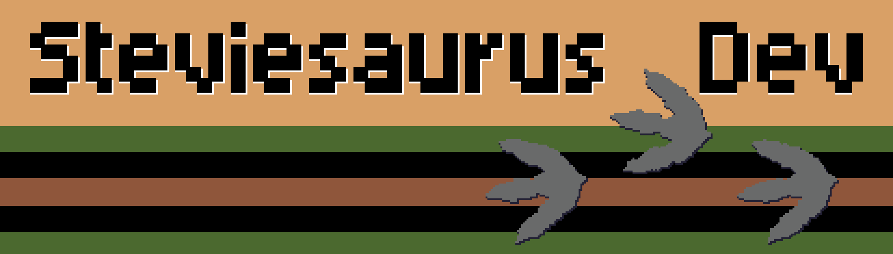

<div align="center">
    <a href="https://steviesaurus-dev.itch.io/">
        
    </a>
</div>

# Commodore BASIC Template

Template repository for building Commodore 64 games in BASIC with VS Code + VS64, plus a matching web template for browser-playable versions on itch.io.

## Personal Quick Start

This section is optimized for starting a new game fast.

### 60-Second Start

1. Copy this template repo and rename it for your new game.
2. Open `c64/` in VS Code.
3. Start VS64 for the `c64` project.
4. Press `F5` to run/debug in VICE.
5. Open `web/index.html` through a local static server when you want the browser version.

### New Game Checklist

1. Rename project/game strings in your BASIC source and web page metadata.
2. Update `c64/src/intro.bas`, `c64/src/gameLoad.bas`, and `c64/src/gameLoop.bas` with your game-specific flow.
3. Add your first playable loop in C64 first, then mirror behavior in `web/scripts`.
4. Replace placeholder images in `web/images`.
5. Keep C64 and web state naming aligned (`intro`, `gameLoad`, `gameLoop`, `gameOver`).
6. When ready for itch.io, zip the contents of `web/` so `index.html` is at zip root.

### Daily Workflow (Short Version)

- Build gameplay and feel in `c64/` first.
- Mirror logic in `web/` for browser play.
- Test often in VICE and browser side-by-side.

## What This Template Includes

- A BASIC project layout designed for C64 game development.
- A starter game loop structure split across focused source files in `c64/src`.
- A browser template in `web/` for building a JavaScript version of the same game.
- A layered canvas setup (`background`, `main`, `foreground`) for C64-style rendering separation.
- Character set setup code that copies the ROM charset to RAM and switches VIC-II to use the RAM charset.
- An Aseprite character template and export script that generates BASIC `data` statements for custom characters.
- Sprite setup code in `characters.bas` that pokes sprite data into RAM and configures VIC-II sprite registers (position, color, size).
- An Aseprite sprite template (`c64-sprites.aseprite`) and export script (`C64 24x21 Sprite BASIC DATA Export.lua`) that generates BASIC `data` statements for a 24x21 hi-res sprite.
- VS64 workspace configuration for build and VICE launch/debug.

## Project Structure

```text
commodore-basic-template/
|- assets/
|  |- c64-character-set.aseprite
|  |- c64-palette.aseprite
|  |- c64-screens.aseprite
|  |- c64-sprites.aseprite
|  |- c64-character-set_Character_Set_Main_c64_chars.bas
|  |- c64-sprites_Sprite_0_c64_sprite.bas
|  |- C64 Standard Character Exporter.lua
|  |- C64 8x8 Character BASIC DATA Layer Export.lua
|  |- C64 8x8 Character BASIC DATA Tilemap Export.lua
|  \- C64 24x21 Sprite BASIC DATA Export.lua
|- c64/
|  |- build/
|  |  |- build.ninja
|  |  \- <game>.prg
|  |- project-config.json
|  \- src/
|     |- characters.bas
|     |- data.bas
|     |- gameLoad.bas
|     |- gameLoop.bas
|     |- gameOver.bas
|     |- intro.bas
|     |- main.bas
|     |- subroutines.bas
|     \- variables.bas
|- web/
|  |- index.html
|  |- style.css
|  |- images/
|  \- scripts/
|     |- asset.mjs
|     |- dom.mjs
|     |- draw.mjs
|     |- index.mjs
|     \- keyboard.mjs
\- README.md
```

## Dual-Target Workflow (C64 + Web)

Use this repository as a two-target game template:

- `c64/` is the Commodore 64 version (source of truth for mechanics and feel).
- `web/` is the JavaScript/browser version for publishing playable builds on itch.io.

Recommended approach:

1. Build and tune gameplay in the C64 version first.
2. Mirror mechanics/screen flow in the web version.
3. Reuse the same naming and state structure where possible (`intro`, `gameLoad`, `gameLoop`, `gameOver`).
4. Export a web build for itch.io's `Play in browser` option.

If you are working solo and moving fast: treat C64 gameplay as source of truth, and use the web version as a playable mirror for sharing.

## VS64 Development Workflow

1. Open the `c64` folder in VS Code. This is required because the VS64 project file lives in `c64`.
2. If this is a fresh setup, run `VS64: Create C64 BASIC Project` once from the command palette.
3. Run the VS64 start command from the `c64` folder. This creates a watcher that stays running while you work in that folder.
4. Develop your game files in `c64/src`.
5. Use `F5` to launch/debug in VICE.
    - VICE must be available on your system path.

In short: open `c64`, start VS64 (watcher), edit in `c64/src`, and press `F5` to test.

## Web Development Workflow

The web template is intentionally lightweight:

- No framework required.
- Native ES modules in `web/scripts`.
- Layered canvases in `web/index.html` for rendering separation.

### Canvas Layers

`web/index.html` includes three canvases in `#game-area`:

- `#game-background`
- `#game-main`
- `#game-foreground`

Use these to mirror classic C64 responsibilities:

- Background: static tiles/screens.
- Main: gameplay sprites/objects.
- Foreground: HUD/effects/overlay.

### Run Locally

Serve the `web` folder with any static server. Example:

```bash
npx serve web
```

Then open the local URL from your terminal output.

## Publishing Web Build to itch.io

For `Play in browser`, upload a ZIP where `index.html` is at the ZIP root.

1. Create a ZIP from the contents of `web/` (not the repository root).
2. In itch.io, create/edit your project and choose `HTML` as the kind of project.
3. Upload the ZIP and enable `This file will be played in the browser`.
4. Set an appropriate viewport in itch (for example, a 4:3 layout if your game uses that ratio).

If your game appears blank on itch, confirm asset paths are relative and still valid after zipping.

### Quick Publish Checklist

1. Confirm the game runs locally from `web/` using a static server.
2. Zip only the contents inside `web/`.
3. Verify `index.html` sits at the zip root.
4. Upload to itch as HTML and enable browser play.

## Source File Responsibilities

- `c64/src/main.bas`: Entry point; includes all modules and drives load -> loop -> game over -> restart.
- `c64/src/variables.bas`: Global variables and array setup.
- `c64/src/characters.bas`: Character and sprite memory setup (VIC bank/screen/charset switch, custom character poke into RAM, sprite data poke into RAM, VIC-II sprite register setup for position/color/size).
- `c64/src/intro.bas`: Intro/title screen logic.
- `c64/src/gameLoad.bas`: Game state initialization.
- `c64/src/gameLoop.bas`: Main gameplay loop.
- `c64/src/gameOver.bas`: End-of-game screen/state.
- `c64/src/subroutines.bas`: Shared helper routines.
- `c64/src/data.bas`: `data` statements (text, char bytes, sprite data, etc.). Includes both the custom character set and sprite data files exported from Aseprite.

## Custom Character Set Setup

The template already includes the base plumbing for custom characters in `c64/src/characters.bas`:

- Disables interrupts during copy setup.
- Exposes character ROM to the CPU.
- Copies character data from ROM into RAM (`49152` onward).
- Restores I/O mapping.
- Switches VIC-II bank/screen/character pointers to use RAM charset.
- Updates BASIC screen pointer.

This means you can start from the standard charset and then overwrite specific character bytes with your own data.

## Aseprite Character Workflow

Assets for creating and exporting characters are in `assets/`:

- `assets/c64-character-set.aseprite`: Starter file for drawing tile-based C64 characters.
- `assets/C64 Standard Character Exporter.lua`: Aseprite script that exports tiles as BASIC `data` lines.

### Using the Export Script

1. In Aseprite, open `File -> Scripts -> Open Scripts Folder`.
2. Copy `C64 Standard Character Exporter.lua` into that scripts folder.
3. Restart Aseprite.
4. Open your `.aseprite` character file and select the tilemap layer.
5. Run the script from `File -> Scripts`.

The script exports one 8-byte character per BASIC `data` line and writes a file named like:

```text
<your-file>.bas
```

### Integrating Exported Character Data

- Include the exported file from `c64/src/data.bas` (typically near the top), for example:

```basic
#include "my_tiles.bas"
```

- You can still paste lines directly if you prefer, but including the exported file keeps data separate and easier to regenerate.
- Read/poke those bytes into your target charset RAM addresses (example loop is already commented in `characters.bas`).
- Keep `data.bas` included at the end of `main.bas` so all data is available to your program.

## Aseprite Sprite Workflow

Assets for creating and exporting sprites are in `assets/`:

- `assets/c64-sprites.aseprite`: Starter file for drawing C64 sprites. Each sprite is a 24x21 layer.
- `assets/c64-palette.aseprite`: C64 color palette reference for use in Aseprite.
- `assets/C64 24x21 Sprite BASIC DATA Export.lua`: Aseprite script that exports one 24x21 hi-res sprite layer as BASIC `data` lines.

### Using the Sprite Export Script

1. In Aseprite, open `File -> Scripts -> Open Scripts Folder`.
2. Copy `C64 24x21 Sprite BASIC DATA Export.lua` into that scripts folder.
3. Restart Aseprite.
4. Open your `.aseprite` sprite file and select the 24x21 layer for the sprite you want to export.
5. Run the script from `File -> Scripts`.

The script validates that the sprite canvas is exactly 24x21 pixels, then exports 7 `data` lines (3 rows × 3 bytes each) and writes a file named like:

```text
<your-file>_<LayerName>_c64_sprite.bas
```

### Integrating Exported Sprite Data

- Include the exported file from `c64/src/data.bas` after the character data:

```basic
#include "../../assets/c64-sprites_Sprite_0_c64_sprite.bas"
```

- The sprite setup code in `characters.bas` reads those `data` bytes and pokes them into RAM at `51200` (`$C800`), which sits inside VIC Bank 3 and away from VIC registers.
- Sprite pointer for sprite 0 lives at screen base + 1016 (`53240`). The pointer value is `(51200 - 49152) / 64 = 32`.
- Sprite registers used: enable (`53269`), X position (`53248`), Y position (`53249`), MSB X overflow (`53264`), color (`53287`), double-width (`53277`), double-height (`53271`).
- To add more sprites, repeat the pointer/poke/register pattern for sprite numbers 1–7.

## Notes

- The template is intentionally minimal so you can shape your own game architecture.
- `gameLoop.bas` uses a `for` loop scaffold as a performance-friendly alternative to tight `goto` loops.
- The default character copy routine copies a large range; optimize it for your game as needed.
